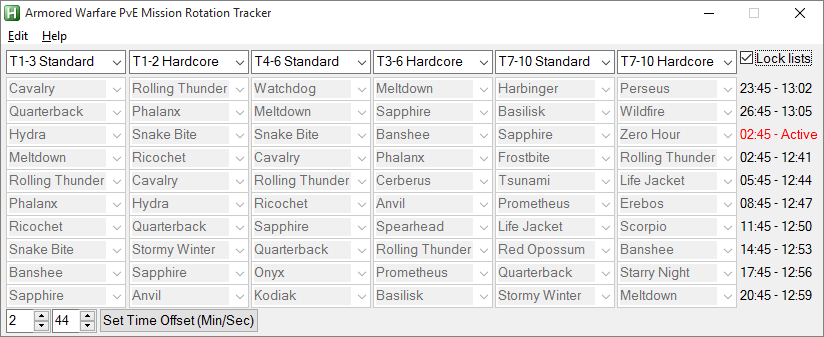

Armored Warfare PvE Mission Rotation Tracker v2 by Haswell & Wiser Guy
=

This program requires no installation, but it does create small text files in the folder it is located in to store data 
such as the missions on rotation, window position, and time offset.

This project is forked from the original Armored Warfare PvE Mission Rotation Tracker v1.01 and v1.05 by Wiser Guy.

FAQ
--
**What language is the tracker written in?**

The tracker is completely based on [AutoHotkey](https://www.autohotkey.com/).

**How do I run it?**

Download the latest binary package (the .exe program) on the [release page](https://github.com/Kasuobes/Rotation-Tracker/releases) and just run it. That's it! No installation or other dependencies required!

**Are there any instructions?**

The help menu should tell you everything. If there are still questions, please [create a new issue](https://github.com/Kasuobes/Rotation-Tracker/issues/new) and I'll answer as soon as I can!

**Why did you make this?**

Not everyone enjoys playing every PvE mission in AW. By tracking the exact order in which the missions will appear every day, you can plan out which maps you want to play on or avoid, and schedule short breaks for yourself. You will no longer have to risk playing arty on Raiding Party!

**Does this violate the game's EULA?**

Not at all! The tracker does not interact with the game client in any way, and its functions can easily be replicated with simple pen and paper.

**I found a bug/have some suggestions! How do I tell you?**

[Create a new issue](https://github.com/Kasuobes/Rotation-Tracker/issues/new) and share your thoughts!

**Can I fork the tracker and develop it on my own?**

Feel free to do so! Just remember to keep the GPLv3 license and credit me in your fork!
